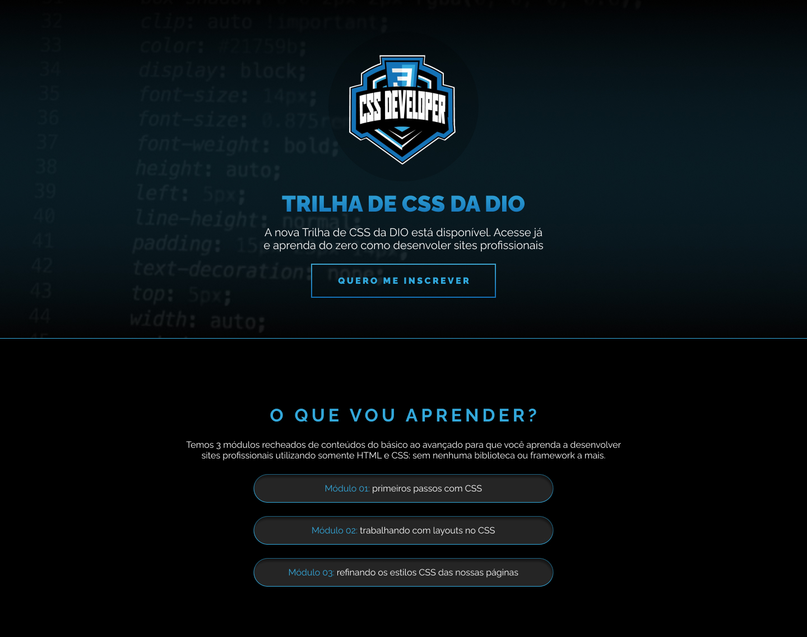

<h1 align="center">Desafio CSS 01</h1>

    Este é um projeto que realizei ao longo dos estudos na DIO, onde coloquei em prática algumas habilidades adquiridas, seguindo o protótipo do Figma disponibilizado e realizando algumas alterações. 

  <a href="#-tecnologias">Tecnologias</a>&nbsp;&nbsp;&nbsp;|&nbsp;&nbsp;&nbsp;
  <a href="#-projeto">Projeto</a>&nbsp;&nbsp;&nbsp;|&nbsp;&nbsp;&nbsp;
  <a href="#-layout">Layout</a>

 

  

## 🚀 Tecnologias

Esse projeto foi desenvolvido com as seguintes tecnologias:

- HTML e CSS
- Git e Github
- Figma

## 🔖 Layout

Você pode visualizar o layout do projeto através [DESSE LINK](https://www.figma.com/design/53IZ0xHmJ5Pq787sZ0KOCH/DIO---Desafio-01-(Copy)?node-id=2-6&t=ypbCWpeJ3VJMLfu9-1) ou o protótipo [NESTE LINK](https://www.figma.com/proto/53IZ0xHmJ5Pq787sZ0KOCH/DIO---Desafio-01-(Copy)?node-id=2-6&node-type=frame&t=ypbCWpeJ3VJMLfu9-0&scaling=min-zoom&content-scaling=fixed&page-id=0%3A1). É necessário ter conta no [Figma](https://figma.com) para acessá-lo.